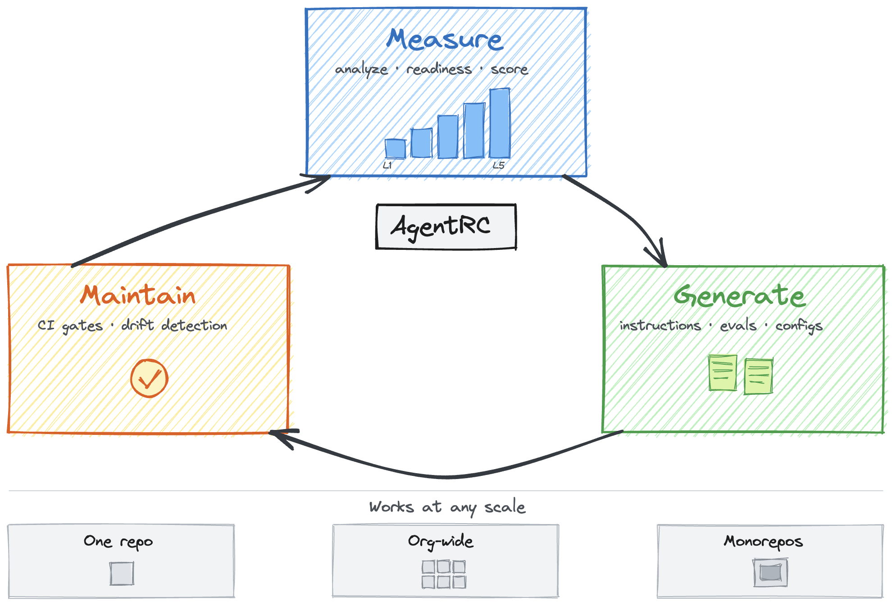

# AgentRC

> Prime your repositories for AI-assisted development.

[](https://github.com/microsoft/agentrc/actions/workflows/ci.yml)
[](LICENSE)

> [!WARNING]
> **Experimental** — This project is under active development. Expect breaking changes to commands, APIs, and output formats. Ready for early adopter feedback — [open an issue](https://github.com/microsoft/agentrc/issues).

AI coding agents are only as effective as the context they receive. AgentRC is a CLI and VS Code extension that closes the gap — from a single repo to hundreds across your org.

**Measure** — Analyze repo structure and score readiness across a 5-level maturity model.
**Generate** — Produce tailored instructions, evals, and dev configs using the Copilot SDK.
**Maintain** — Run evaluations in CI to catch instruction drift as code evolves.



## Quick Start

```bash
# Run directly (no install needed)
npx github:microsoft/agentrc readiness
```

`npx github:<owner>/agentrc ...` installs from the Git repository and runs the package `prepare` script, which builds the CLI before first use.

Or install locally:

```bash
git clone https://github.com/microsoft/agentrc.git
cd agentrc && npm install && npm run build && npm link

# 1. Inspect the repo shape
agentrc analyze

# 2. Check how AI-ready your repo is
agentrc readiness

# 3. Generate instructions
agentrc instructions

# 4. Generate MCP and VS Code configs
agentrc generate mcp
agentrc generate vscode

# Or do the guided flow interactively
agentrc init
```

## Prerequisites

| Requirement                       | Notes                                                            |
| --------------------------------- | ---------------------------------------------------------------- |
| **Node.js 20+**                   | Runtime                                                          |
| **GitHub Copilot CLI**            | Bundled with the VS Code Copilot Chat extension                  |
| **Copilot authentication**        | Run `copilot` → `/login`                                         |
| **GitHub CLI** _(optional)_       | For batch processing and PRs: `brew install gh && gh auth login` |
| **Azure DevOps PAT** _(optional)_ | Set `AZURE_DEVOPS_PAT` for Azure DevOps workflows                |

## Commands

### `agentrc analyze` — Inspect Repository Structure

Detects languages, frameworks, monorepo/workspace structure, and area mappings:

```bash
agentrc analyze                                # terminal summary
agentrc analyze --json                         # machine-readable analysis
agentrc analyze --output analysis.json         # save JSON report
agentrc analyze --output analysis.md           # save Markdown report
agentrc analyze --output analysis.json --force # overwrite existing report
```

### `agentrc readiness` — Run Readiness Report

Score a repo across 9 pillars grouped into **Repo Health** and **AI Setup**:

```bash
agentrc readiness                        # terminal summary
agentrc readiness --visual               # GitHub-themed HTML report
agentrc readiness --per-area             # include per-area breakdown
agentrc readiness --output readiness.json # save JSON report
agentrc readiness --output readiness.md   # save Markdown report
agentrc readiness --output readiness.html # save HTML report
agentrc readiness --policy ./examples/policies/strict.json # apply a custom policy
agentrc readiness --json                 # machine-readable JSON
agentrc readiness --fail-level 3         # CI gate: exit 1 if below level 3
```

**Maturity levels:**

| Level | Name         | What it means                                       |
| ----- | ------------ | --------------------------------------------------- |
| 1     | Functional   | Builds, tests, basic tooling in place               |
| 2     | Documented   | README, CONTRIBUTING, custom instructions exist     |
| 3     | Standardized | CI/CD, security policies, CODEOWNERS, observability |
| 4     | Optimized    | MCP servers, custom agents, AI skills configured    |
| 5     | Autonomous   | Full AI-native development with minimal oversight   |

At Level 2, AgentRC also checks **instruction consistency** — when a repo has multiple AI instruction files (e.g. `copilot-instructions.md`, `CLAUDE.md`, `AGENTS.md`), it detects whether they diverge. Symlinked or identical files pass; diverging files fail with a similarity score and a suggestion to consolidate.

### `agentrc instructions` — Generate Instructions

Generate instructions using the Copilot SDK:

```bash
agentrc instructions                      # copilot-instructions.md (default)
agentrc instructions --output AGENTS.md   # custom output path
agentrc instructions --strategy nested    # nested hub + detail files in .agents/
agentrc instructions --areas              # root + all detected areas
agentrc instructions --area frontend      # single area
agentrc instructions --areas-only         # areas only (skip root)
agentrc instructions --dry-run             # preview without writing
agentrc instructions --model claude-sonnet-4.6
```

**Concepts:**

- **Format**: Output file — `copilot-instructions.md` (default) or `AGENTS.md` (via `--output`)
- **Strategy**: `flat` (single file, default) or `nested` (hub + per-topic detail files)
- **Scope**: `root only` (default), `--areas` (root + areas), `--area <name>` (single area)

### `agentrc eval` — Evaluate Instructions

Measure how instructions improve AI responses with a judge model:

```bash
agentrc eval --init                       # scaffold eval config from codebase
agentrc eval agentrc.eval.json             # run evaluation
agentrc eval --model gpt-4.1 --judge-model claude-sonnet-4.6
agentrc eval --fail-level 80              # CI gate: exit 1 if pass rate < 80%
```

### `agentrc generate` — Generate Configs

> **Note:** `generate instructions` and `generate agents` are deprecated — use `agentrc instructions` directly.

```bash
agentrc generate mcp                      # .vscode/mcp.json
agentrc generate vscode --force           # .vscode/settings.json (overwrite)
```

### `agentrc batch` / `agentrc pr` — Batch & PRs

```bash
agentrc batch                             # interactive TUI (GitHub)
agentrc batch --provider azure            # Azure DevOps
agentrc batch owner/repo1 owner/repo2 --json
agentrc batch-readiness --output team.html
agentrc pr owner/repo-name                # clone → generate → open PR
```

### `agentrc tui` — Interactive Mode

```bash
agentrc tui
```

### `agentrc init` — Init Repository

Interactive or headless repo onboarding — analyzes your stack and generates instructions. For monorepos, auto-detects workspaces and bootstraps `agentrc.config.json` with workspace and area definitions.

### Global Options

All commands support `--json` (structured JSON to stdout) and `--quiet` (suppress stderr). JSON output uses a `CommandResult<T>` envelope:

```json
{ "ok": true, "status": "success", "data": { ... } }
```

### Readiness Policies

Policies customize scoring criteria, override metadata, and tune thresholds:

```bash
agentrc readiness --policy ./examples/policies/strict.json
agentrc readiness --policy ./examples/policies/strict.json,./my-overrides.json  # chain multiple
```

```json
{
  "name": "my-org-policy",
  "criteria": {
    "disable": ["lint-config"],
    "override": { "readme": { "impact": "high", "level": 2 } }
  },
  "extras": { "disable": ["pre-commit"] },
  "thresholds": { "passRate": 0.9 }
}
```

Policies can also be set in `agentrc.config.json` (`{ "policies": ["./my-policy.json"] }`).

### Configuration File

`agentrc.config.json` (repo root or `.github/`) configures areas, workspaces, and policies:

```json
{
  "areas": [{ "name": "docs", "applyTo": "docs/**" }],
  "workspaces": [
    {
      "name": "frontend",
      "path": "packages/frontend",
      "areas": [
        { "name": "app", "applyTo": "app/**" },
        { "name": "shared", "applyTo": ["shared/**", "common/**"] }
      ]
    }
  ],
  "policies": ["./policies/strict.json"]
}
```

- **`areas`** — standalone areas with glob patterns (relative to repo root)
- **`workspaces`** — monorepo sub-projects; each workspace groups areas scoped to a subdirectory. Area `applyTo` patterns are relative to the workspace path. Workspace areas get namespaced names (`frontend/app`) and a `workingDirectory` for scoped eval sessions.
- `agentrc init` auto-detects workspaces (via `.vscode` folders and sibling-area grouping) and bootstraps this file.

> **Security:** Config-sourced policies are restricted to JSON files only — JS/TS module policies must be passed via `--policy`.

See [docs/plugins.md](docs/plugins.md) for the full plugin authoring guide, including imperative TypeScript plugins, lifecycle hooks, and the trust model.

## Development

```bash
npm run typecheck        # type check
npm run lint             # ESLint (flat config + Prettier)
npm run test             # Vitest tests
npm run test:coverage    # with coverage
npm run build            # production build via tsup
npx tsx src/index.ts --help  # run from source
```

### VS Code Extension

```bash
cd vscode-extension
npm install && npm run build
# Press F5 to launch Extension Development Host
```

See [CONTRIBUTING.md](CONTRIBUTING.md) for workflow and code style guidelines.

## Project Structure

```
packages/core/
└── src/
  ├── index.ts          # Shared public API surface
  ├── services/         # Core product logic reused by CLI and extension
  │   ├── readiness.ts   # 9-pillar scoring engine with pillar groups
  │   ├── visualReport.ts # HTML report generator
  │   ├── instructions.ts # Copilot SDK integration
  │   ├── analyzer.ts    # Repo scanning (languages, frameworks, monorepos)
  │   ├── evaluator.ts   # Eval runner + trajectory viewer
  │   ├── generator.ts   # MCP/VS Code config generation
  │   ├── policy.ts      # Readiness policy loading and chain resolution
  │   ├── policy/        # Plugin engine (types, compiler, loader, adapter, shadow)
  │   ├── git.ts         # Git operations (clone, branch, push)
  │   ├── github.ts      # GitHub API (Octokit)
  │   └── azureDevops.ts # Azure DevOps API
  └── utils/            # Shared utilities (fs, logger, output)

src/
├── cli.ts                # Commander CLI wiring
├── commands/             # CLI subcommands (thin orchestrators)
├── index.ts              # CLI entrypoint
└── ui/                   # Ink/React terminal UI

vscode-extension/         # VS Code extension shell over packages/core
```

## Troubleshooting

**"Copilot CLI not found"** — Install the GitHub Copilot Chat extension in VS Code. The CLI is bundled with it.

**"Copilot CLI not logged in"** — Run `copilot` in your terminal, then `/login` to authenticate.

**"GitHub authentication required"** — Install GitHub CLI (`brew install gh && gh auth login`) or set `GITHUB_TOKEN` / `GH_TOKEN`.

## License

[MIT](LICENSE)

## Trademarks

This project may contain trademarks or logos for projects, products, or services. Authorized use of Microsoft trademarks or logos is subject to and must follow [Microsoft's Trademark & Brand Guidelines](https://www.microsoft.com/en-us/legal/intellectualproperty/trademarks/usage/general). Use of Microsoft trademarks or logos in modified versions of this project must not cause confusion or imply Microsoft sponsorship. Any use of third-party trademarks or logos are subject to those third-party's policies.
